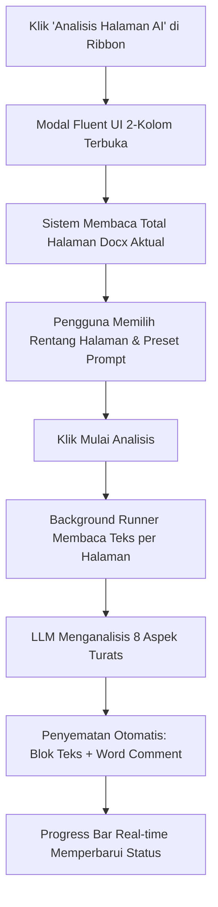

# Dokumentasi Teknis Sistem GenOffice
**Versi:** 0.10.0  
**Tanggal:** September 2026  
**Status:** Produksi / Siap Rilis (Production Ready)  

---

## Daftar Isi
1. [Ringkasan Eksekutif](#1-ringkasan-eksekutif)
2. [Arsitektur Monorepo & Modul](#2-arsitektur-monorepo--modul)
3. [Modul Manuskrip Transcriber (`apps/docxeditor`)](#3-modul-manuskrip-transcriber-appsdocxeditor)
4. [Fitur Analisis Halaman AI Turats & Filologi](#4-fitur-analisis-halaman-ai-turats--filologi)
5. [Sistem Lokalisasi Multibahasa (i18n)](#5-sistem-lokalisasi-multibahasa-i18n)
6. [Galeri Preset AI & Prompt Manager](#6-galeri-preset-ai--prompt-manager)
7. [Pipeline Build & Packaging Windows Executable (.exe)](#7-pipeline-build--packaging-windows-executable-exe)
8. [Panduan Operasional & Perintah Teknis](#8-panduan-operasional--perintah-teknis)

---

## 1. Ringkasan Eksekutif
GenOffice adalah aplikasi perkantoran terpadu berbasis AI (*AI-Native Office Suite*) yang dibangun di atas platform **Electron**, **React**, **TypeScript**, dan engine komputasi native (**Rust** & **WebAssembly**). Dokumen teknis ini merangkum pemutakhiran arsitektur terbaru, khususnya modul **Manuskrip Transcriber (Transkripsi Kitab/Naskah AI)**, **Fitur Analisis Halaman AI Berbasis 8 Aspek Turats**, **Sistem Lokalisasi Penuh Bahasa Indonesia & Bahasa Arab**, serta **Pipeline Packaging Executable Windows (.exe)**.

---

## 2. Arsitektur Monorepo & Modul

GenOffice menggunakan arsitektur monorepo berbasis NPM Workspaces:

```
genoffice/
├── apps/
│   ├── shell/         # Container utama pembungkus seluruh modul, tab manager, launcher window
│   ├── docxeditor/    # Modul Manuskrip Transcriber & Live Word Editor
│   ├── docs/          # Modul Pengolah Kata (Word/Docx)
│   ├── sheets/        # Modul Spreadsheet (Didukung Rust Sidecar Engine)
│   ├── slides/        # Modul Presentasi (PowerPoint/PPTX)
│   ├── pdf/           # Modul PDF Editor & WASM HarfBuzz Text Layout
│   ├── markdown/      # Modul Markdown Editor
│   └── html/          # Modul HTML Editor
├── packages/
│   ├── agent-core/    # AI Agent Engine & Protocol
│   ├── ai-provider/   # Adapter LLM (Gemini, Claude, GPT, Local LLM)
│   ├── docx-engine/   # Parsing, Serialisasi, dan Roundtrip AST OpenXML/Docx
│   ├── electron-utils/# Skema IPC dan secure bridge preload
│   ├── font-metrics/  # Pengukuran layout teks, CJK, dan Arab font HarfBuzz
│   ├── i18n/          # Kamus terjemahan 20 bahasa
│   └── ui/            # Fluent UI Design System Tokens
└── release/           # Output installer executable (.exe)
```

---

## 3. Modul Manuskrip Transcriber (`apps/docxeditor`)

Modul `docxeditor` dirancang untuk mentranskripsi naskah/manuskrip fisik (PDF/Gambar kuno/Kitab Kuning) menjadi dokumen Microsoft Word (`.docx`) yang hidup (*live editable*).

### Komponen Utama:
1. **Vision AI Transcription Engine**:
   - Membaca citra halaman per halaman melalui multi-modal AI Vision.
   - Mengonversi teks berharakat, aksara Arab gundul/pegon, dan tabel naskah ke dalam struktur hierarki heading dan paragraf.
2. **Live Layout & Pagination**:
   - Menggunakan model CSS Multi-Column & Layout Gap (`.page-gap`) untuk mereplikasi tata letak halaman Word secara 1:1.
   - Perhitungan batas halaman dinamis (*Page Break Detection*) berbasis koordinat viewport dan DOM node rendering.
3. **TipTap & Prosemirror Word Engine**:
   - Skema dokumen mendukung komentar (*Word Comments*), revisi terlacak (*Track Changes*), teks RTL/Bidi, catatan kaki (*footnotes*), dan rumus matematika.

---

## 4. Fitur Analisis Halaman AI Turats & Filologi

Fitur ini memungkinkan pengguna menganalisis isi dokumen Word halaman demi halaman secara otomatis di latar belakang tanpa mengganggu alur penulisan. AI akan menyeleksi kata/kalimat yang memerlukan perbaikan dan menyematkan **Word Comment & Highlight** secara langsung.

### 4.1. Alur Kerja (Workflow):


### 4.2. 8 Aspek Keilmuan Analisis Turats:
Sistem prompt tetap (*Fixed System Prompt*) diinjeksikan secara otomatis untuk memastikan ketelitian filologi tinggi:
1. **Rasm & Ortografi**: Memeriksa penulisan huruf Arab standar, alif layyinah, ta' marbuthah, dan rasm Utsmani.
2. **Harakat & Vokalisasi**: Menyarankan harakat yang tepat pada kata kunci atau kalimat yang rawan salah baca (*tashif/tahrif*).
3. **I'rab & Sintaksis (Nahwu)**: Memvalidasi kedudukan gramatikal (marfu', manshub, majrur, majzum).
4. **Morfologi (Sharaf)**: Memeriksa bentuk wazan kata kerja dan tashrif istilahi/lughawi.
5. **Diksi & Kosakata Klasik**: Memberikan alternatif kosakata fusha yang lebih presisi sesuai konteks bab kitab.
6. **Balaghoh & Gaya Bahasa**: Menganalisis keindahan majaz, isti'arah, dan struktur balaghi.
7. **Konsistensi Istilah**: Menjaga keseragaman istilah teknis fiqih, ushul, aqidah, atau tasawuf di sepanjang naskah.
8. **Struktur Matan & Syarah**: Memastikan batas antara teks matan dan penjelasan syarah/hamisy tetap teratur.

### 4.3. Bahasa Pengantar Komentar Adaptif:
Sistem prompt otomatis menyematkan instruksi bahasa pengantar:
```ts
const appLangName = getLanguageDisplayName(currentLang);
// Contoh: "Tuliskan seluruh isi komentar analisis dalam Bahasa Indonesia yang formal, santun, dan jelas."
```

---

## 5. Sistem Lokalisasi Multibahasa (i18n)

1. **Bahasa Default**: Disetel ke Bahasa Indonesia (`id`) secara default pada inisialisasi aplikasi pertama kali (`packages/i18n/src/index.ts`).
2. **Onboarding Modal**: Diterjemahkan penuh ke dalam Bahasa Indonesia dengan pengenalan visual modul *Manuskrip Transcriber*.
3. **Menu Ribbon Terjemahkan (Translate)**:
   - File: `apps/docxeditor/src/renderer/components/ribbon-tabs.tsx`
   - Target Terjemahan:
     - **Terjemahkan ke bahasa Indonesia** (`ribbonLangIndonesian`)
     - **Terjemahkan ke bahasa Arab** (`ribbonLangArabic`)
     - Terjemahkan ke bahasa Inggris, Mandarin, Jepang, Korea, Prancis, Jerman, dan Spanyol.
   - Sinkronisasi lengkap pada **20 berkas kamus i18n** di `apps/docxeditor/src/renderer/i18n/ribbon/` (`id.ts`, `ar.ts`, `en.ts`, `zh.ts`, `de.ts`, `fr.ts`, dll.).

---

## 6. Galeri Preset AI & Prompt Manager

Sistem memisahkan antara prompt sistem yang ketat dengan preset instruksi yang fleksibel:
- **Preset Built-in**:
  - `pol-translate-id`: Terjemahan Bahasa Indonesia Baku (EYD & KBBI).
  - `pol-translate-ar`: Terjemahan Bahasa Arab Fusha Standar Modern.
  - `pol-turats-8aspek`: Analisis Mendalam 8 Aspek Kitab Turats.
  - `pol-harakat-irab`: Penambahan Harakat & Catatan I'rab Kata Kunci.
  - `pol-tashif-koreksi`: Deteksi Salah Ketik (Tashif/Tahrif) Naskah.
- **Custom Preset Manager**: Pengguna dapat menambah, mengedit, dan menghapus preset prompt kustom yang tersimpan di `localStorage` tanpa risiko terhapus saat update aplikasi.

---

## 7. Pipeline Build & Packaging Windows Executable (.exe)

### 7.1. Konfigurasi Electron Builder:
- **File**: `apps/shell/electron-builder.cjs`
- **Output Target**: Windows 64-bit NSIS Installer (`.exe`)
- **Hasil Kompilasi**:
  - **Installer**: `apps/shell/release/GenOffice Setup 0.10.0.exe` (~158 MB)
  - **Portable / Unpacked**: `apps/shell/release/win-unpacked/GenOffice.exe`

### 7.2. Modul yang Dikemas ke dalam Installer:
- Seluruh modul editor (`docs`, `sheets`, `slides`, `pdf`, `markdown`, `html`, `docxeditor`) dimasukkan ke dalam `extraResources/modules/`.
- **Rust Sidecar Engine**: `xlsx-sidecar.exe` untuk kalkulasi spreadsheet ultra-cepat.
- **WASM Engine**: `pdfium.wasm` dan `hb-subset.wasm` (HarfBuzz) untuk render PDF & pembentukan font glyph Arab/Turats.
- **Third Party Notices & Chromium Licenses**: Disertakan secara otomatis sesuai lisensi Apache-2.0.

---

## 8. Panduan Operasional & Perintah Teknis

### Menjalankan Mode Development:
```bash
npm run dev
```

### Menjalankan Typecheck TypeScript:
```bash
npm run typecheck
```

### Menjalankan Pengujian Unit (Unit Test):
```bash
npm run test
```

### Membangun Seluruh Bundle Produksi:
```bash
npm run build:all
```

### Membuat File Installer Windows (.exe):
```bash
npm run dist:win
```

---
*Dokumentasi ini disusun sebagai standar teknis arsitektur dan rujukan pengembangan GenOffice.*
